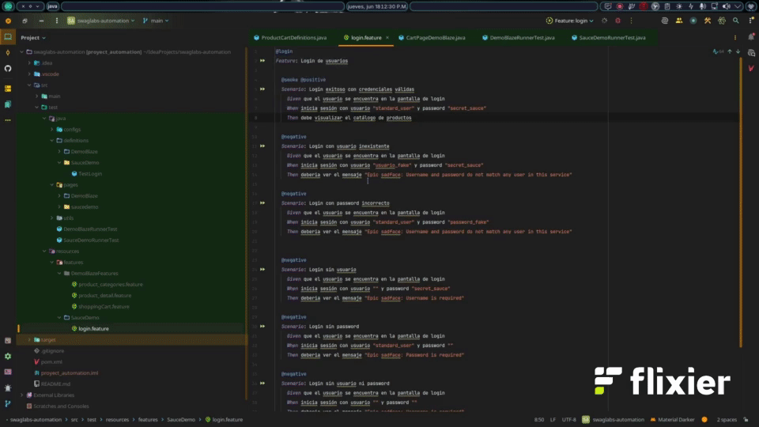

# 🧪 Swag Labs Automation

Framework de automatización de pruebas E2E para [Swag Labs](https://www.saucedemo.com), construido con **Selenium + Cucumber BDD + JUnit** en Java 21.

---

## 🎬 Demo



---

## 📖 Descripción

Este proyecto implementa un framework de automatización de pruebas funcionales sobre el sitio de demo **Swag Labs** (saucedemo.com), utilizando el patrón **BDD (Behavior Driven Development)** con escenarios escritos en **Gherkin** (lenguaje natural).

El objetivo es validar los flujos principales de la aplicación, como login, navegación del catálogo de productos, carrito de compras y proceso de checkout.

---

## 🛠️ Tecnologías

| Tecnología | Versión | Uso |
|---|---|---|
| Java | 21 | Lenguaje base |
| Maven | — | Gestión de dependencias y build |
| Selenium Java | 4.40.0 | Automatización del navegador |
| Cucumber Java | 7.15.0 | Framework BDD |
| Cucumber JUnit | 7.15.0 | Runner de pruebas Cucumber |
| JUnit Jupiter API | 6.0.3 | Aserciones y pruebas unitarias |
| WebDriverManager | 5.7.0 | Gestión automática de drivers |

---

## ✅ Prerrequisitos

Antes de ejecutar el proyecto asegúrate de tener instalado:

- **Java JDK 21** → [Descargar](https://adoptium.net/)
- **Maven 3.8+** → [Descargar](https://maven.apache.org/download.cgi)
- Un navegador compatible (Chrome, Firefox, Edge)

> WebDriverManager descarga y configura automáticamente el driver del navegador, no es necesario instalarlo manualmente.

---

## 📁 Estructura del proyecto

```
swaglabs-automation/
├── src/
│   ├── main/
│   │   └── java/
│   │       └── ...             # Páginas (Page Objects) y utilidades
│   └── test/
│       ├── java/
│       │   ├── runners/        # Clase runner de Cucumber
│       │   └── steps/          # Step definitions
│       └── resources/
│           └── features/       # Archivos .feature (Gherkin)
├── .gitignore
├── pom.xml
└── README.md
```

---

## ⚙️ Instalación

1. Clona el repositorio:

```bash
git clone https://github.com/GaboDevCode/swaglabs-automation.git
cd swaglabs-automation
```

2. Instala las dependencias:

```bash
mvn clean install -DskipTests
```

---

## ▶️ Ejecución de pruebas

Ejecutar todos los tests:

```bash
mvn test
```

Ejecutar un feature específico por tag:

```bash
mvn test -Dcucumber.filter.tags="@login"
```

---

## 📐 Convenciones

- Los escenarios BDD se escriben en español dentro de los archivos `.feature`.
- Las clases Java siguen la nomenclatura **PascalCase** para clases y **camelCase** para métodos.
- Se aplica el patrón **Page Object Model (POM)** para mantener la separación entre la lógica de UI y los step definitions.


---

## 👤 Autor

**Gabriel** — [@GaboDevCode](https://github.com/GaboDevCode)
